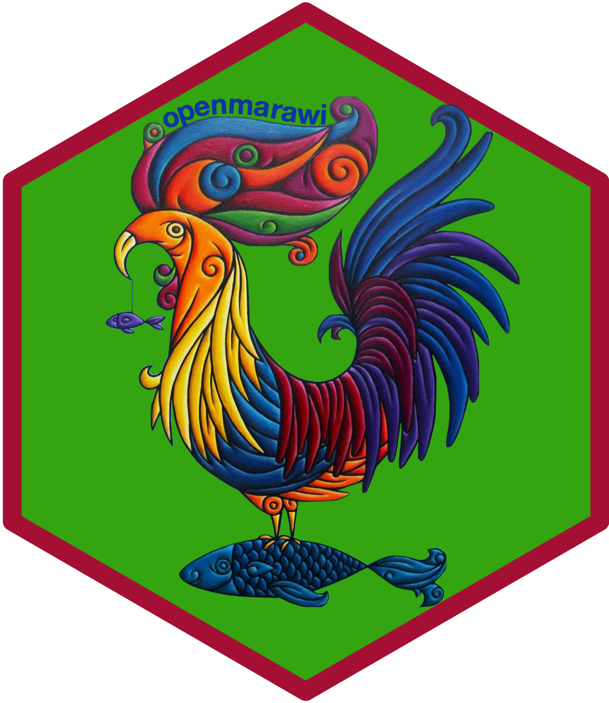

<!-- README.md is generated from README.Rmd. Please edit that file -->

# openmarawi: An Interface to the Open Marawi Database 

<!-- badges: start -->

[](https://www.repostatus.org/#wip)
[](https://lifecycle.r-lib.org/articles/stages.html#experimental)
[](https://github.com/panukatan/openmarawi/actions/workflows/R-CMD-check.yaml)
[](https://github.com/panukatan/openmarawi/actions/workflows/test-coverage.yaml)
[](https://www.codefactor.io/repository/github/panukatan/openmarawi)
<!-- badges: end -->

From the [Open Marawi website](www.openmarawi.com)

> ## Why Open Marawi?

> The citizens of Marawi have a right to the data and maps about their
> home city. When problems are complex, helping people find useful maps
> (access) can aid them both in finding themselves in the map
> (understanding) and making the map by themselves (ownership).

> Open data and useful maps can help empower citizens in mapmaking,
> placemaking, and decision-making because it can help citizens and
> interested parties in understanding the issues spatially. It is
> practical in deliberating, deciding, and delivering the rehabilitation
> of Marawi City.

The `openmarawi` R package supports this effort by providing an
application programming interface to the [Open Marawi shared Google
Drive](https://drive.google.com/drive/folders/1bph1LBRpxwydAvjuggyjmhmq6HhyteY8).
Consistent with the principles of Open Marawi, the `openmarawi` R
package is built and distributed open source on a platform that allows
and encourages community contribution using a programming language that
is also open and freely available to use.

We believe that through this added layer of interface to the Open Marawi
datasets, a cadre of users and developers - including those from Marawi
itself - can support the process of mapmaking, placemaking, and
decision-making that the Open Marawi effort has initiated and continue
to encourage.

## What does `openmarawi` do?

Please note that `openmarawi` is still highly experimental and is
undergoing a lot of development. Hence, any functionalities described
below and in the rest of the package documentation have a high
likelihood of changing interface or approach as we aim for a stable
working version.

Currently, the package provides functions for retrieving Google Drive
specific drive information for main Open Marawi Google Drive and its
sub-directories.

## Installation

`openmarawi` is not yet on CRAN but can be installed from the [panukatan
R universe](https://panukatan.r-universe.dev) as follows:

``` r
install.packages(
  "openmarawi",
  repos = c('https://panukatan.r-universe.dev', 'https://cloud.r-project.org')
)
```

## Usage

## Citation

If you find the `openmarawi` package useful please cite using the
suggested citation provided by a call to the `citation()` function as
follows:

``` r
citation("openmarawi")
#> To cite openmarawi in publications use:
#> 
#>   Ernest Guevarra (2024). openmarawi: An Interface to the Open Marawi
#>   Database R package version 0.0.0.9000 URL
#>   https://panukatan.io/openmarawi/
#> 
#> A BibTeX entry for LaTeX users is
#> 
#>   @Manual{,
#>     title = {openmarawi: An Interface to the Open Marawi Database},
#>     author = {{Ernest Guevarra}},
#>     year = {2024},
#>     note = {R package version 0.0.0.9000},
#>     url = {https://panukatan.io/openmarawi/},
#>   }
```

## Community guidelines

Feedback, bug reports and feature requests are welcome; file issues or
seek support [here](https://github.com/panukatan/openmarawi/issues). If
you would like to contribute to the package, please see our
[contributing
guidelines](https://panukatan.io/openmarawi/CONTRIBUTING.html).

This project is released with a [Contributor Code of
Conduct](https://panukatan.io/openmarawi/CODE_OF_CONDUCT.html). By
participating in this project you agree to abide by its terms.
